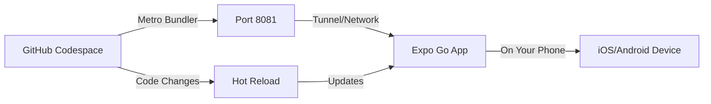

# GitHub Codespaces Setup Plan

## Overview

This document outlines the setup and configuration for developing SparksApp in GitHub Codespaces. Since SparksApp is a React Native application targeting **Android and iOS only** (no web), development in Codespaces is optimized for **Expo Go** testing on physical devices.

## Current State

### ✅ What's Working

As of the latest update, Codespaces is functional for web-based development:

1. **Codespace Creation**: Users can create a Codespace via direct URL:
   ```
   https://github.com/codespaces/new?skip_quickstart=true&machine=standardLinux32gb&repo=1048220194&ref=main&devcontainer_path=.devcontainer%2Fdevcontainer.json&geo=UsWest
   ```

2. **AI-Assisted Development**: GitHub Copilot/Chat can be used to make code changes within the Codespace

3. **Web Development**: Expo can be run in web mode:
   ```bash
   npx expo start --web --tunnel
   ```
   This allows testing the app in a browser within the Codespace

4. **Git Workflow**: Changes can be committed and merged directly from the Codespace

### Existing Configuration

**[.devcontainer/devcontainer.json](file:///Users/mattdyor/SparksApp/.devcontainer/devcontainer.json)**:
- Base image: `mcr.microsoft.com/devcontainers/universal:latest`
- Post-create command: `npm install && npm install -g expo-cli`
- VS Code extensions: React Native, Expo, EditorConfig
- Port forwarding: 8081 (Metro), 19000 (Expo DevTools)
- CPU requirement: 4 cores

### Known Issues

1. **Expo Go Tunneling Not Working**: 
   - Tunneling to Android and iOS devices via Expo Go does not appear to be functioning
   - Users cannot connect physical devices to test native features
   - This limits development to web-only mode currently

2. **Command Execution UX**:
   - Users must manually open a terminal, know the exact command (`npx expo start --web --tunnel`), paste it, and run it
   - No prominent UI element (like a big button) to start the development server
   - This creates friction for new users who may not know the command

3. **Git Merge Conflicts on Codespace Creation**:
   - Each new Codespace creation requires resolving merge conflicts
   - This happens even when no changes have been made to the main codebase
   - May require a git sync step immediately after Codespace creation
   - Creates unnecessary friction in the onboarding process

4. **Pull Request Workflow**:
   - No simple way for users to submit Pull Requests from Codespaces
   - Users need to understand git commands and PR creation process
   - Would benefit from a simplified flow (e.g., a big button) to create PRs
   - This is especially important for contributors who may not be familiar with git workflows

## Development Model: Expo Go

### Why Expo Go?

Since Codespaces is a cloud-based environment:
- ❌ Cannot run iOS Simulator (requires macOS)
- ❌ Cannot run Android Emulator efficiently (requires nested virtualization, very slow)
- ✅ **Can use Expo Go** on physical devices via network/tunnel
- ✅ Supports full development workflow (edit code, hot reload, test on device)
- ✅ No platform-specific build tools needed

### How It Works



1. Developer edits code in Codespace (cloud environment)
2. Metro Bundler runs in Codespace, exposed via port forwarding
3. Developer opens Expo Go app on their physical phone
4. Expo Go connects to Codespace via:
   - **Option A**: Tunnel (easiest, works anywhere)
   - **Option B**: Same network (faster, requires VPN or local network)
5. App runs on phone with hot reload for instant updates

## Proposed Configuration Updates

### 1. Updated devcontainer.json

```json
{
    "name": "SparksApp - React Native (Expo Go)",
    "image": "mcr.microsoft.com/devcontainers/javascript-node:1-20-bookworm",
    
    // Setup script handles environment and dependencies
    "postCreateCommand": "bash .devcontainer/setup.sh",
    
    // VS Code customizations
    "customizations": {
        "vscode": {
            "extensions": [
                "msjsdiag.vscode-react-native",
                "expo.vscode-expo",
                "EditorConfig.EditorConfig",
                "dbaeumer.vscode-eslint",
                "esbenp.prettier-vscode"
            ],
            "settings": {
                "terminal.integrated.defaultProfile.linux": "bash",
                "editor.formatOnSave": true,
                "editor.defaultFormatter": "esbenp.prettier-vscode",
                "editor.codeActionsOnSave": {
                    "source.fixAll.eslint": "explicit"
                },
                "[typescript]": {
                    "editor.defaultFormatter": "esbenp.prettier-vscode"
                },
                "[typescriptreact]": {
                    "editor.defaultFormatter": "esbenp.prettier-vscode"
                },
                "files.exclude": {
                    "**/.expo": true,
                    "**/.expo-shared": true,
                    "**/node_modules": true
                }
            }
        }
    },
    
    // Port forwarding for Expo
    "forwardPorts": [
        8081,  // Metro Bundler
        19000, // Expo DevTools (legacy)
        19001, // Expo DevTools
        19002  // Expo DevTools
    ],
    "portsAttributes": {
        "8081": {
            "label": "Metro Bundler",
            "onAutoForward": "notify"
        },
        "19000": {
            "label": "Expo DevTools",
            "onAutoForward": "silent"
        }
    },
    
    // Resource requirements
    "hostRequirements": {
        "cpus": 4,
        "memory": "8gb",
        "storage": "32gb"
    },
    
    // Features
    "features": {
        "ghcr.io/devcontainers/features/node:1": {
            "version": "20"
        },
        "ghcr.io/devcontainers/features/git:1": {
            "version": "latest"
        }
    }
}
```

### 2. Setup Script (.devcontainer/setup.sh)

```bash
#!/bin/bash
set -e

echo "🚀 Setting up SparksApp development environment..."

# Install dependencies
echo "📦 Installing npm packages..."
npm install

# Setup environment variables if .env doesn't exist
if [ ! -f .env ]; then
    echo "🔑 Creating .env file from template..."
    if [ -f .env.example ]; then
        cp .env.example .env
        echo "⚠️  IMPORTANT: Edit .env file with your Firebase credentials!"
        echo "   You can find these in Firebase Console > Project Settings > General"
    else
        echo "❌ Warning: .env.example not found"
    fi
else
    echo "✅ .env file already exists"
fi

# Display helpful information
echo ""
echo "✅ Setup complete!"
echo ""
echo "📱 To start developing with Expo Go:"
echo "   1. Run: npx expo start --tunnel"
echo "   2. Open Expo Go app on your phone"
echo "   3. Scan the QR code that appears"
echo ""
echo "🔑 Don't forget to configure your .env file with Firebase credentials!"
echo ""
```

### 3. Environment Variables Documentation

Update `.env.example` to include Gemini API key:

```bash
# Firebase Configuration (Required)
EXPO_PUBLIC_FIREBASE_API_KEY=your_api_key
EXPO_PUBLIC_FIREBASE_AUTH_DOMAIN=your_project_id.firebaseapp.com
EXPO_PUBLIC_FIREBASE_PROJECT_ID=your_project_id
EXPO_PUBLIC_FIREBASE_STORAGE_BUCKET=your_project_id.firebasestorage.app
EXPO_PUBLIC_FIREBASE_MESSAGING_SENDER_ID=your_sender_id
EXPO_PUBLIC_FIREBASE_APP_ID=your_app_id
EXPO_PUBLIC_FIREBASE_MEASUREMENT_ID=your_measurement_id

# Google Sign-In (Required for authentication)
EXPO_PUBLIC_GOOGLE_WEB_CLIENT_ID=your_web_client_id.apps.googleusercontent.com

# Gemini AI (Required for RecAIpe and Minute Minder)
EXPO_PUBLIC_GEMINI_API_KEY=your_gemini_api_key

# Instructions:
# 1. Copy this file to .env: cp .env.example .env
# 2. Get Firebase credentials: https://console.firebase.google.com/
#    Project Settings > General > Your apps > Web app
# 3. Get Gemini API key: https://makersuite.google.com/app/apikey
# 4. Replace all "your_*" placeholders with actual values
```

## Implementation Plan

### Phase 1: Update Configuration Files

- [ ] Update `.devcontainer/devcontainer.json` with new configuration
- [ ] Create `.devcontainer/setup.sh` script
- [ ] Make setup script executable: `chmod +x .devcontainer/setup.sh`
- [ ] Update `.env.example` to include Gemini API key
- [ ] Add `.env` to `.gitignore` if not already present

### Phase 2: Documentation

- [ ] Create Codespace-specific README section
- [ ] Document Expo Go connection process
- [ ] Add troubleshooting guide
- [ ] Document environment variable setup

### Phase 3: Testing

- [ ] Create new Codespace from updated config
- [ ] Verify automatic setup runs correctly
- [ ] Test Expo Go connection via tunnel
- [ ] Verify hot reload works
- [ ] Test all major Sparks features

## How to Create a GitHub Codespace

### Prerequisites

Before you start:
- ✅ GitHub account (free tier includes 120 core-hours/month)
- ✅ Access to the SparksApp repository (must be a collaborator or have it forked)
- ✅ Firebase project with credentials ready
- ✅ Gemini API key (optional, but needed for RecAIpe and Minute Minder)

### Method 1: From GitHub Repository (Recommended)

This is the easiest way to create a Codespace.

1. **Navigate to the Repository**
   - Go to https://github.com/yourusername/SparksApp
   - Make sure you're on the branch you want to work on (usually `main`)

2. **Open the Codespaces Menu**
   - Click the green **"Code"** button (top right of the file list)
   - Select the **"Codespaces"** tab
   
   > You'll see a list of any existing Codespaces or an option to create a new one

3. **Create New Codespace**
   - Click **"Create codespace on main"** (or your branch name)
   - Alternatively, click the **"+"** button to create with default settings
   
   > **Tip**: Click the dropdown arrow (⌄) next to the "+" for advanced options (machine type, region)

4. **Wait for Container Build**
   - GitHub will provision a container (first time: 3-5 minutes)
   - You'll see progress in the browser
   - The setup script will automatically run
   
   > **What's happening**: Installing Node.js, npm packages, creating .env template

5. **Codespace Opens in Browser**
   - VS Code will open in your browser
   - Terminal at the bottom will show setup completion message
   - File explorer on the left shows project files

### Method 2: From GitHub Codespaces Dashboard

Useful for managing multiple Codespaces or resuming work.

1. **Go to Codespaces Dashboard**
   - Visit https://github.com/codespaces
   - Or: GitHub profile → Settings → Codespaces

2. **Create New Codespace**
   - Click **"New codespace"** button (top right)
   - Select repository: `yourusername/SparksApp`
   - Select branch: `main` (or your working branch)
   - Choose machine type: **4-core** (recommended minimum)
   - Click **"Create codespace"**

3. **Wait for Setup**
   - Same 3-5 minute build process as Method 1
   - Opens automatically when ready

### Method 3: Using GitHub CLI (Advanced)

For command-line users who have `gh` CLI installed.

```bash
# Create a new Codespace
gh codespace create --repo yourusername/SparksApp --branch main

# Or create and connect immediately
gh codespace create --repo yourusername/SparksApp --branch main --web
```

### Method 4: Using VS Code Desktop (Optional)

If you prefer VS Code desktop over browser.

1. **Install GitHub Codespaces Extension**
   - Open VS Code desktop application
   - Install extension: `GitHub.codespaces`

2. **Sign in to GitHub**
   - Command Palette (Cmd/Ctrl + Shift + P)
   - Type: "Codespaces: Sign In"

3. **Create Codespace**
   - Command Palette → "Codespaces: Create New Codespace"
   - Select repository and branch
   - Codespace opens in VS Code desktop

### After Codespace is Created

Once your Codespace is running, you'll see:

```
🚀 Setting up SparksApp development environment...
📦 Installing npm packages...
🔑 Creating .env file from template...
⚠️  IMPORTANT: Edit .env file with your Firebase credentials!
✅ Setup complete!

📱 To start developing with Expo Go:
   1. Run: npx expo start --tunnel
   2. Open Expo Go app on your phone
   3. Scan the QR code that appears
```

**Next Steps**:
1. Edit the `.env` file with your credentials (see below)
2. Start Expo development server
3. Connect your phone

### Configuring Environment Variables

After Codespace creation, configure your environment:

1. **Open `.env` file**
   - In VS Code file explorer, click `.env`
   - File was auto-created from `.env.example`

2. **Get Firebase Credentials**
   - Go to [Firebase Console](https://console.firebase.google.com/)
   - Select your project → ⚙️ Settings → Project Settings
   - Scroll to "Your apps" → Web app
   - Copy all config values

3. **Get Gemini API Key**
   - Go to [Google AI Studio](https://makersuite.google.com/app/apikey)
   - Click "Create API Key"
   - Copy the key

4. **Update `.env` File**
   Replace placeholder values with real credentials:
   ```bash
   EXPO_PUBLIC_FIREBASE_API_KEY=AIzaSy... (your real key)
   EXPO_PUBLIC_FIREBASE_PROJECT_ID=sparks-app-12345
   # ... etc for all variables
   EXPO_PUBLIC_GEMINI_API_KEY=AIzaSy... (your Gemini key)
   ```

5. **Save the File**
   - Press Cmd/Ctrl + S to save
   - Changes are auto-synced to the cloud

### Managing Your Codespace

**Stopping a Codespace** (to save core-hours):
- Click your Codespace name (bottom left of VS Code)
- Select "Stop Current Codespace"
- Or: Visit https://github.com/codespaces and click "Stop"

**Resuming a Codespace**:
- Visit https://github.com/codespaces
- Find your Codespace in the list
- Click the name to reopen

**Deleting a Codespace**:
- Visit https://github.com/codespaces
- Click "..." menu next to Codespace
- Select "Delete"
- Confirm deletion

**Auto-sleep Settings**:
- Codespaces auto-sleep after 30 minutes of inactivity (default)
- Configure in: Settings → Codespaces → Default idle timeout

### Troubleshooting Codespace Creation

**"Codespace creation failed"**:
- Check if you have available core-hours (GitHub settings)
- Try selecting a different region
- Verify repository access permissions

**"Setup script failed"**:
- Check `.devcontainer/setup.sh` exists
- Verify `package.json` is present
- Delete and recreate the Codespace

**"Out of storage"**:
- Delete old Codespaces you're not using
- Free tier includes 15GB storage total
- Each Codespace uses ~2-4GB

## Developer Workflow

### First-Time Setup

1. **Open in Codespace**
   - Navigate to the repo on GitHub
   - Click "Code" > "Codespaces" > "Create codespace on main"
   - Wait for container to build (3-5 minutes)

2. **Configure Environment**
   - Edit `.env` file with Firebase and Gemini credentials
   - Verify all environment variables are set

3. **Start Development Server**
   ```bash
   npx expo start --tunnel --go
   ```
   - `--tunnel`: Required for Codespaces (creates public URL)
   - `--go`: Forces Expo Go mode (prevents dev build mode)

4. **Connect Phone**
   - Install Expo Go on your phone ([iOS](https://apps.apple.com/app/expo-go/id982107779) | [Android](https://play.google.com/store/apps/details?id=host.exp.exponent))
   - Open Expo Go app
   - Scan QR code from terminal
   - Look for tunnel URL: `exp://xxx.tunnel.exp.dev:8081`

5. **Start Developing**
   - Edit code in VS Code (in browser)
   - Changes auto-reload on your phone
   - Use console logs visible in terminal

### Daily Workflow

1. **Open Codespace**
   - Go to github.com/codespaces
   - Click on your existing Codespace (or create new)

2. **Start Expo**
   ```bash
   npx expo start --tunnel --go
   ```

3. **Connect Device**
   - Open Expo Go
   - App should remember last project
   - Or scan QR code again

4. **Develop**
   - Edit files in VS Code
   - Test on device via hot reload
   - Debug with console logs

## Connection Options

### Option 1: Tunnel (Recommended)

**Pros:**
- Works from anywhere (home, coffee shop, etc.)
- No network configuration needed
- Most reliable

**Cons:**
- Slightly slower than local network
- Requires internet connection

**Command:**
```bash
npx expo start --tunnel --go
```

### Option 2: LAN (Faster, Local Network Only)

**Pros:**
- Faster reload times
- Lower latency

**Cons:**
- Phone and Codespace must be on same network
- Requires VPN setup for cloud-to-device connection
- More complex configuration

**Command:**
```bash
npx expo start --lan
```

**Note**: For Codespaces, tunnel mode is highly recommended as LAN mode won't work without VPN.

## Troubleshooting

### Tunnel Not Working / Site Cannot Be Reached

**Problem**: Getting "site cannot be reached" error or seeing local IP (10.0.0.x:8081) instead of tunnel URL

**Symptoms**:
- Error connecting to `10.0.0.137:8081` or similar local IP
- No tunnel URL appears (no `.tunnel.exp.dev` domain)
- QR code shows `exp://10.0.0.x:8081` instead of tunnel URL

**Solutions:**

1. **Install ngrok dependency**:
   ```bash
   npm install --save-dev @expo/ngrok --legacy-peer-deps
   ```

2. **Stop and restart with tunnel flag**:
   ```bash
   # Stop current server (Ctrl+C)
   npx expo start --tunnel --go --clear
   ```

3. **Verify tunnel is actually running**:
   Look for output like:
   ```
   › Metro waiting on exp://xxx-xxx.tunnel.exp.dev:8081
   › Tunnel ready
   ```

4. **Check for firewall/network blocks**:
   - Some corporate networks block tunneling
   - Try from personal WiFi/hotspot if possible

5. **Use explicit tunnel service**:
   ```bash
   npx expo start --tunnel --tunnel-service ngrok --go
   ```

**Why this happens**:
- Codespaces is in the cloud, your phone can't reach it via local network
- Tunnel creates a public URL that works from anywhere
- Without tunnel, Expo defaults to LAN mode which won't work

### Starting in Development Build Instead of Expo Go

**Problem**: Expo opens in "development build" mode instead of Expo Go

**Symptoms**:
- Message says "Open with development build"
- Can't select Expo Go option
- App won't load in Expo Go

**Solutions:**

1. **Use --go flag explicitly**:
   ```bash
   npx expo start --tunnel --go
   ```

2. **Clear Expo cache**:
   ```bash
   npx expo start --tunnel --go --clear
   ```

3. **Check for dev build config**:
   Look in `app.json` or `app.config.js` for:
   ```json
   {
     "expo": {
       "developmentClient": true  // Remove or set to false
     }
   }
   ```

4. **Remove ios/android folders** (if they exist):
   ```bash
   # These folders trigger dev build mode
   rm -rf ios android
   npx expo start --tunnel --go
   ```

**Why this happens**:
- If you've run `npx expo run:ios` or `npx expo run:android`, it creates native folders
- Those folders make Expo think you want dev build mode
- The `--go` flag forces Expo Go mode

### QR Code Won't Scan

**Problem**: Expo Go can't connect after scanning QR code

**Solutions:**
1. Make sure port 8081 is publicly accessible in Codespace
2. Try using the tunnel URL directly: `exp://[tunnel-url]`
3. Check if Expo Go app is up to date
4. Restart Codespace and try again

### Metro Bundler Fails to Start

**Problem**: Error when running `npx expo start`

**Solutions:**
1. Clear cache: `npx expo start -c`
2. Delete node_modules: `rm -rf node_modules && npm install`
3. Check port 8081 isn't already in use

### Environment Variables Not Found

**Problem**: Firebase or Gemini features not working

**Solutions:**
1. Verify `.env` file exists: `ls -la .env`
2. Check all variables start with `EXPO_PUBLIC_`
3. Restart Metro bundler after editing `.env`
4. Verify no extra spaces or quotes in `.env` values

### Hot Reload Not Working

**Problem**: Code changes don't appear on device

**Solutions:**
1. Shake device and select "Reload"
2. Check Metro bundler terminal for errors
3. Verify network connection is stable
4. Try stopping and restarting `npx expo start`

### Build Errors After Package Updates

**Problem**: App crashes after npm install

**Solutions:**
1. Clear Expo cache: `npx expo start -c`
2. Clear watchman: `watchman watch-del-all` (if available)
3. Clear Metro cache: `rm -rf .expo`
4. Reinstall: `rm -rf node_modules package-lock.json && npm install`

### Dependency Resolution Errors

**Problem**: `npm install` fails with "ERESOLVE unable to resolve dependency tree" or React version conflicts

**Error Example**:
```
npm error ERESOLVE unable to resolve dependency tree
npm error While resolving: sparksapp@1.0.10
npm error Found: react@19.1.0
```

**Solutions:**
1. **Use legacy peer deps** (bypasses strict peer dependency checking):
   ```bash
   npm install --legacy-peer-deps
   ```

2. **Full clean reinstall**:
   ```bash
   rm -rf node_modules package-lock.json
   npm install --legacy-peer-deps
   ```

3. **Force installation** (alternative to legacy-peer-deps):
   ```bash
   npm install --force
   ```

**Why this happens**: 
- React Native and Expo projects often have complex peer dependencies
- React 19 is newer and some packages haven't updated their peer dep declarations
- The `--legacy-peer-deps` flag tells npm to install despite warnings (safe for this project)

**Note**: The setup script now uses `--legacy-peer-deps` automatically to prevent this issue.

## Limitations

### What Works ✅

- Full code editing with IntelliSense
- Hot reload on device
- All Expo Go compatible features
- JavaScript debugging via logs
- Git operations
- npm package management
- Firebase services (auth, firestore, analytics)
- Gemini AI features (RecAIpe, Minute Minder, Speak Spark)
- Most native modules that Expo Go supports

### What Doesn't Work ❌

- **Native iOS/Android simulators/emulators** (cloud limitation)
- **Native builds** (use `eas build` from local machine instead)
- **Custom native modules** not in Expo Go (requires dev build)
- **App Store submissions** (use local machine or `eas submit`)
- **Direct debugging** (use console logs and React DevTools instead)

## Alternatives for Native Development

If you need features that don't work in Codespaces:

1. **Local Development**: Clone repo locally for native builds
2. **EAS Build**: Use `npx eas-cli build` from anywhere for cloud builds
3. **Hybrid Approach**: Develop in Codespace, build on local machine
4. **Dev Client**: Create custom dev build, but still test on physical device

## Best Practices

### Performance

- **Use tunnel mode**: Most reliable for Codespaces
- **Clear cache regularly**: `npx expo start -c`
- **Minimize console logs**: Too many logs can slow hot reload
- **Close unused Codespaces**: Save on usage limits

### Security

- **Never commit `.env`**: Always in `.gitignore`
- **Use separate Firebase project**: Don't use production credentials
- **Rotate API keys regularly**: Especially if using Gemini default key
- **Enable 2FA**: On GitHub account for Codespace access

### Efficiency

- **Use VS Code extensions**: ESLint, Prettier for code quality
- **Leverage hot reload**: Make small incremental changes
- **Test on real devices**: More accurate than any simulator
- **Keep dependencies updated**: Run `npm outdated` periodically

## Cost Considerations

GitHub Codespaces has usage limits:

- **Free tier**: 120 core-hours/month, 15 GB-month storage
- **4-core machine**: ~30 hours/month free
- **8 GB storage**: Well within free limit

**Tips to optimize:**
- Stop Codespace when not actively developing
- Use "Auto-sleep" settings (30 min idle time)
- Delete old Codespaces you're not using

## Proposed Resolutions

### Issue 1: Expo Go Tunneling Not Working

**Problem**: Cannot connect Android/iOS devices via Expo Go tunnel

**Proposed Solutions**:

1. **Verify Tunnel Configuration**:
   - Ensure `@expo/ngrok` is installed: `npm install --save-dev @expo/ngrok --legacy-peer-deps`
   - Check that port 8081 is properly forwarded in Codespace settings
   - Verify tunnel service is available: `npx expo start --tunnel --tunnel-service ngrok`

2. **Alternative: Use Expo Dev Client**:
   - Create a development build that can be installed on devices
   - Use EAS Build to create a dev client build
   - Install the dev client on physical devices
   - Connect to Codespace via tunnel URL

3. **Network Configuration Check**:
   - Verify Codespace firewall rules allow tunnel connections
   - Check if corporate networks are blocking tunnel services
   - Consider using Expo's cloud tunnel service instead of ngrok

4. **Documentation Update**:
   - Add troubleshooting section specifically for tunnel issues in Codespaces
   - Document fallback to web-only development mode
   - Provide clear error messages when tunnel fails

### Issue 2: Command Execution UX

**Problem**: Users must manually run commands in terminal

**Proposed Solutions**:

1. **VS Code Tasks**:
   - Create `.vscode/tasks.json` with predefined tasks:
     ```json
     {
       "version": "2.0.0",
       "tasks": [
             {
                "label": "Start Expo (Web)",
                "type": "shell",
                "command": "npx expo start --web --tunnel",
                "problemMatcher": []
             },
         {
           "label": "Start Expo (Tunnel)",
           "type": "shell",
           "command": "npx expo start --tunnel --go",
           "problemMatcher": []
         }
       ]
     }
     ```
   - Users can run via Command Palette (Cmd/Ctrl+Shift+P) → "Tasks: Run Task"

2. **VS Code Launch Configuration**:
   - Add `.vscode/launch.json` for one-click debugging
   - Create launch configurations for different Expo modes

3. **Custom Codespace Commands**:
   - Add custom commands to `.devcontainer/devcontainer.json`:
     ```json
     "customizations": {
       "codespaces": {
         "commands": {
           "start-web": "npx expo start --web --tunnel",
           "start-tunnel": "npx expo start --tunnel --go"
         }
       }
     }
     ```

4. **Welcome Script**:
   - Create a post-create script that displays a welcome message with clickable commands
   - Use VS Code's terminal link feature to make commands clickable
   - Add a README.md in Codespace root with quick start commands

5. **GitHub Codespaces Custom Button** (Future):
   - GitHub may add support for custom action buttons in Codespaces
   - Could create a simple web interface for common commands

### Issue 3: Git Merge Conflicts on Creation

**Problem**: Merge conflicts appear when creating new Codespace

**Proposed Solutions**:

1. **Pre-Creation Git Sync Script**:
   - Add to `.devcontainer/setup.sh`:
     ```bash
     # Sync git state
     echo "🔄 Syncing git repository..."
     git fetch origin
     git reset --hard origin/main
     git clean -fd
     ```
   - Ensures Codespace starts with clean, up-to-date state

2. **Branch Strategy**:
   - Always create Codespaces from `main` branch (or specific branch)
   - Avoid creating from feature branches that may be out of sync
   - Document recommended branch for Codespace creation

3. **Git Configuration**:
   - Set up git config in setup script:
     ```bash
     git config --global pull.rebase false
     git config --global init.defaultBranch main
     ```

4. **Pre-Create Hook** (if supported):
   - Check if GitHub Codespaces supports pre-create hooks
   - Run git sync before container build starts

5. **Documentation**:
   - Add clear instructions: "If you see merge conflicts, run: `git reset --hard origin/main`"
   - Include this in the welcome message shown after Codespace creation

### Issue 4: Pull Request Workflow

**Problem**: No simple way to create Pull Requests from Codespaces

**Proposed Solutions**:

1. **GitHub CLI Integration**:
   - Install `gh` CLI in devcontainer: `ghcr.io/devcontainers/features/github-cli:1`
   - Create a helper script `scripts/create-pr.sh`:
     ```bash
     #!/bin/bash
     BRANCH_NAME="codespace-$(date +%s)"
     git checkout -b $BRANCH_NAME
     git add .
     git commit -m "$1"
     git push -u origin $BRANCH_NAME
     gh pr create --title "$1" --body "Created from Codespace"
     ```
   - Make executable and add to PATH

2. **VS Code GitHub Extension**:
   - Ensure GitHub Pull Requests extension is installed
   - Users can create PRs directly from VS Code UI
   - Extension provides GUI for PR creation

3. **Custom VS Code Task**:
   - Add task to `.vscode/tasks.json`:
     ```json
     {
       "label": "Create Pull Request",
       "type": "shell",
       "command": "${workspaceFolder}/scripts/create-pr.sh",
       "problemMatcher": []
     }
     ```
   - Users run via Command Palette

4. **GitHub Codespaces Custom Button** (Future):
   - If GitHub adds support, create a "Create PR" button
   - Could use GitHub API to create PRs programmatically

5. **Simplified Workflow Documentation**:
   - Create a step-by-step guide with screenshots
   - Add a "Quick PR" section to README
   - Include common PR templates

6. **Automated PR Creation Script**:
   - Create `scripts/quick-pr.sh` that:
     - Prompts for PR title and description
     - Creates branch, commits changes, pushes, creates PR
     - Uses `gh` CLI for PR creation
   - Make it executable: `chmod +x scripts/quick-pr.sh`
   - Users can run: `./scripts/quick-pr.sh "My PR Title"`

## Implementation Priority

1. **High Priority**:
   - Fix git merge conflicts (Issue 3) - blocks smooth onboarding
   - Improve command UX (Issue 2) - improves developer experience

2. **Medium Priority**:
   - PR workflow simplification (Issue 4) - improves contribution flow
   - Tunnel troubleshooting (Issue 1) - enables native testing

3. **Low Priority**:
   - Advanced features (custom buttons, web interfaces)
   - Enhanced documentation

## Future Enhancements

Potential improvements to the Codespace setup:

- [ ] Add pre-commit hooks via husky
- [ ] Include React Native Debugger configuration
- [ ] Add custom Codespace commands for common tasks
- [ ] Script to check environment variable validity
- [ ] Automated testing setup with Jest
- [ ] GitHub Actions integration for automated checks
- [ ] Documentation for using React DevTools with Expo Go
- [ ] Custom GitHub Codespaces action buttons (when available)
- [ ] Web-based command runner interface
- [ ] Automated PR template generation

---

**Status**: Active Development  
**Created**: 2025-12-13  
**Last Updated**: 2025-12-15  
**Owner**: Matt Dyor
