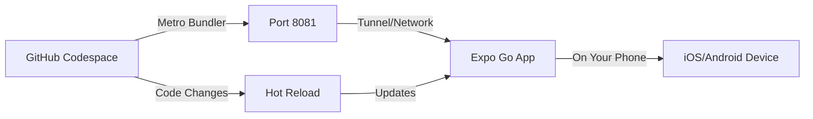

# GitHub Codespaces Setup Plan

## Overview

This document outlines the setup and configuration for developing SparksApp in GitHub Codespaces. Since SparksApp is a React Native application targeting **Android and iOS only** (no web), development in Codespaces is optimized for **Expo Go** testing on physical devices.

## Current State

### Existing Configuration

**[.devcontainer/devcontainer.json](file:///Users/mattdyor/SparksApp/.devcontainer/devcontainer.json)**:
- Base image: `mcr.microsoft.com/devcontainers/universal:latest`
- Post-create command: `npm install && npm install -g expo-cli`
- VS Code extensions: React Native, Expo, EditorConfig
- Port forwarding: 8081 (Metro), 19000 (Expo DevTools)
- CPU requirement: 4 cores

### Issues with Current Setup

1. **Deprecated Expo CLI**: The command `npm install -g expo-cli` installs the deprecated standalone CLI. Modern Expo uses `npx expo` instead.

2. **Missing Environment Variables**: No automated setup for required Firebase and Gemini API keys

3. **No Setup Instructions**: Missing documentation for first-time Codespace users

4. **Incomplete Port Configuration**: May need additional ports for Expo tunneling

## Development Model: Expo Go

### Why Expo Go?

Since Codespaces is a cloud-based environment:
- ❌ Cannot run iOS Simulator (requires macOS)
- ❌ Cannot run Android Emulator efficiently (requires nested virtualization, very slow)
- ✅ **Can use Expo Go** on physical devices via network/tunnel
- ✅ Supports full development workflow (edit code, hot reload, test on device)
- ✅ No platform-specific build tools needed

### How It Works



1. Developer edits code in Codespace (cloud environment)
2. Metro Bundler runs in Codespace, exposed via port forwarding
3. Developer opens Expo Go app on their physical phone
4. Expo Go connects to Codespace via:
   - **Option A**: Tunnel (easiest, works anywhere)
   - **Option B**: Same network (faster, requires VPN or local network)
5. App runs on phone with hot reload for instant updates

## Proposed Configuration Updates

### 1. Updated devcontainer.json

```json
{
    "name": "SparksApp - React Native (Expo Go)",
    "image": "mcr.microsoft.com/devcontainers/javascript-node:1-20-bookworm",
    
    // Setup script handles environment and dependencies
    "postCreateCommand": "bash .devcontainer/setup.sh",
    
    // VS Code customizations
    "customizations": {
        "vscode": {
            "extensions": [
                "msjsdiag.vscode-react-native",
                "expo.vscode-expo",
                "EditorConfig.EditorConfig",
                "dbaeumer.vscode-eslint",
                "esbenp.prettier-vscode"
            ],
            "settings": {
                "terminal.integrated.defaultProfile.linux": "bash",
                "editor.formatOnSave": true,
                "editor.defaultFormatter": "esbenp.prettier-vscode",
                "editor.codeActionsOnSave": {
                    "source.fixAll.eslint": "explicit"
                },
                "[typescript]": {
                    "editor.defaultFormatter": "esbenp.prettier-vscode"
                },
                "[typescriptreact]": {
                    "editor.defaultFormatter": "esbenp.prettier-vscode"
                },
                "files.exclude": {
                    "**/.expo": true,
                    "**/.expo-shared": true,
                    "**/node_modules": true
                }
            }
        }
    },
    
    // Port forwarding for Expo
    "forwardPorts": [
        8081,  // Metro Bundler
        19000, // Expo DevTools (legacy)
        19001, // Expo DevTools
        19002  // Expo DevTools
    ],
    "portsAttributes": {
        "8081": {
            "label": "Metro Bundler",
            "onAutoForward": "notify"
        },
        "19000": {
            "label": "Expo DevTools",
            "onAutoForward": "silent"
        }
    },
    
    // Resource requirements
    "hostRequirements": {
        "cpus": 4,
        "memory": "8gb",
        "storage": "32gb"
    },
    
    // Features
    "features": {
        "ghcr.io/devcontainers/features/node:1": {
            "version": "20"
        },
        "ghcr.io/devcontainers/features/git:1": {
            "version": "latest"
        }
    }
}
```

### 2. Setup Script (.devcontainer/setup.sh)

```bash
#!/bin/bash
set -e

echo "🚀 Setting up SparksApp development environment..."

# Install dependencies
echo "📦 Installing npm packages..."
npm install

# Setup environment variables if .env doesn't exist
if [ ! -f .env ]; then
    echo "🔑 Creating .env file from template..."
    if [ -f .env.example ]; then
        cp .env.example .env
        echo "⚠️  IMPORTANT: Edit .env file with your Firebase credentials!"
        echo "   You can find these in Firebase Console > Project Settings > General"
    else
        echo "❌ Warning: .env.example not found"
    fi
else
    echo "✅ .env file already exists"
fi

# Display helpful information
echo ""
echo "✅ Setup complete!"
echo ""
echo "📱 To start developing with Expo Go:"
echo "   1. Run: npx expo start --tunnel"
echo "   2. Open Expo Go app on your phone"
echo "   3. Scan the QR code that appears"
echo ""
echo "🔑 Don't forget to configure your .env file with Firebase credentials!"
echo ""
```

### 3. Environment Variables Documentation

Update `.env.example` to include Gemini API key:

```bash
# Firebase Configuration (Required)
EXPO_PUBLIC_FIREBASE_API_KEY=your_api_key
EXPO_PUBLIC_FIREBASE_AUTH_DOMAIN=your_project_id.firebaseapp.com
EXPO_PUBLIC_FIREBASE_PROJECT_ID=your_project_id
EXPO_PUBLIC_FIREBASE_STORAGE_BUCKET=your_project_id.firebasestorage.app
EXPO_PUBLIC_FIREBASE_MESSAGING_SENDER_ID=your_sender_id
EXPO_PUBLIC_FIREBASE_APP_ID=your_app_id
EXPO_PUBLIC_FIREBASE_MEASUREMENT_ID=your_measurement_id

# Google Sign-In (Required for authentication)
EXPO_PUBLIC_GOOGLE_WEB_CLIENT_ID=your_web_client_id.apps.googleusercontent.com

# Gemini AI (Required for RecAIpe and Minute Minder)
EXPO_PUBLIC_GEMINI_API_KEY=your_gemini_api_key

# Instructions:
# 1. Copy this file to .env: cp .env.example .env
# 2. Get Firebase credentials: https://console.firebase.google.com/
#    Project Settings > General > Your apps > Web app
# 3. Get Gemini API key: https://makersuite.google.com/app/apikey
# 4. Replace all "your_*" placeholders with actual values
```

## Implementation Plan

### Phase 1: Update Configuration Files

- [ ] Update `.devcontainer/devcontainer.json` with new configuration
- [ ] Create `.devcontainer/setup.sh` script
- [ ] Make setup script executable: `chmod +x .devcontainer/setup.sh`
- [ ] Update `.env.example` to include Gemini API key
- [ ] Add `.env` to `.gitignore` if not already present

### Phase 2: Documentation

- [ ] Create Codespace-specific README section
- [ ] Document Expo Go connection process
- [ ] Add troubleshooting guide
- [ ] Document environment variable setup

### Phase 3: Testing

- [ ] Create new Codespace from updated config
- [ ] Verify automatic setup runs correctly
- [ ] Test Expo Go connection via tunnel
- [ ] Verify hot reload works
- [ ] Test all major Sparks features

## Developer Workflow

### First-Time Setup

1. **Open in Codespace**
   - Navigate to the repo on GitHub
   - Click "Code" > "Codespaces" > "Create codespace on main"
   - Wait for container to build (3-5 minutes)

2. **Configure Environment**
   - Edit `.env` file with Firebase and Gemini credentials
   - Verify all environment variables are set

3. **Start Development Server**
   ```bash
   npx expo start --tunnel
   ```

4. **Connect Phone**
   - Install Expo Go on your phone ([iOS](https://apps.apple.com/app/expo-go/id982107779) | [Android](https://play.google.com/store/apps/details?id=host.exp.exponent))
   - Open Expo Go app
   - Scan QR code from terminal

5. **Start Developing**
   - Edit code in VS Code (in browser)
   - Changes auto-reload on your phone
   - Use console logs visible in terminal

### Daily Workflow

1. **Open Codespace**
   - Go to github.com/codespaces
   - Click on your existing Codespace (or create new)

2. **Start Expo**
   ```bash
   npx expo start --tunnel
   ```

3. **Connect Device**
   - Open Expo Go
   - App should remember last project
   - Or scan QR code again

4. **Develop**
   - Edit files in VS Code
   - Test on device via hot reload
   - Debug with console logs

## Connection Options

### Option 1: Tunnel (Recommended)

**Pros:**
- Works from anywhere (home, coffee shop, etc.)
- No network configuration needed
- Most reliable

**Cons:**
- Slightly slower than local network
- Requires internet connection

**Command:**
```bash
npx expo start --tunnel
```

### Option 2: LAN (Faster, Local Network Only)

**Pros:**
- Faster reload times
- Lower latency

**Cons:**
- Phone and Codespace must be on same network
- Requires VPN setup for cloud-to-device connection
- More complex configuration

**Command:**
```bash
npx expo start --lan
```

**Note**: For Codespaces, tunnel mode is highly recommended as LAN mode won't work without VPN.

## Troubleshooting

### QR Code Won't Scan

**Problem**: Expo Go can't connect after scanning QR code

**Solutions:**
1. Make sure port 8081 is publicly accessible in Codespace
2. Try using the tunnel URL directly: `exp://[tunnel-url]`
3. Check if Expo Go app is up to date
4. Restart Codespace and try again

### Metro Bundler Fails to Start

**Problem**: Error when running `npx expo start`

**Solutions:**
1. Clear cache: `npx expo start -c`
2. Delete node_modules: `rm -rf node_modules && npm install`
3. Check port 8081 isn't already in use

### Environment Variables Not Found

**Problem**: Firebase or Gemini features not working

**Solutions:**
1. Verify `.env` file exists: `ls -la .env`
2. Check all variables start with `EXPO_PUBLIC_`
3. Restart Metro bundler after editing `.env`
4. Verify no extra spaces or quotes in `.env` values

### Hot Reload Not Working

**Problem**: Code changes don't appear on device

**Solutions:**
1. Shake device and select "Reload"
2. Check Metro bundler terminal for errors
3. Verify network connection is stable
4. Try stopping and restarting `npx expo start`

### Build Errors After Package Updates

**Problem**: App crashes after npm install

**Solutions:**
1. Clear Expo cache: `npx expo start -c`
2. Clear watchman: `watchman watch-del-all` (if available)
3. Clear Metro cache: `rm -rf .expo`
4. Reinstall: `rm -rf node_modules package-lock.json && npm install`

## Limitations

### What Works ✅

- Full code editing with IntelliSense
- Hot reload on device
- All Expo Go compatible features
- JavaScript debugging via logs
- Git operations
- npm package management
- Firebase services (auth, firestore, analytics)
- Gemini AI features (RecAIpe, Minute Minder, Speak Spark)
- Most native modules that Expo Go supports

### What Doesn't Work ❌

- **Native iOS/Android simulators/emulators** (cloud limitation)
- **Native builds** (use `eas build` from local machine instead)
- **Custom native modules** not in Expo Go (requires dev build)
- **App Store submissions** (use local machine or `eas submit`)
- **Direct debugging** (use console logs and React DevTools instead)

## Alternatives for Native Development

If you need features that don't work in Codespaces:

1. **Local Development**: Clone repo locally for native builds
2. **EAS Build**: Use `npx eas-cli build` from anywhere for cloud builds
3. **Hybrid Approach**: Develop in Codespace, build on local machine
4. **Dev Client**: Create custom dev build, but still test on physical device

## Best Practices

### Performance

- **Use tunnel mode**: Most reliable for Codespaces
- **Clear cache regularly**: `npx expo start -c`
- **Minimize console logs**: Too many logs can slow hot reload
- **Close unused Codespaces**: Save on usage limits

### Security

- **Never commit `.env`**: Always in `.gitignore`
- **Use separate Firebase project**: Don't use production credentials
- **Rotate API keys regularly**: Especially if using Gemini default key
- **Enable 2FA**: On GitHub account for Codespace access

### Efficiency

- **Use VS Code extensions**: ESLint, Prettier for code quality
- **Leverage hot reload**: Make small incremental changes
- **Test on real devices**: More accurate than any simulator
- **Keep dependencies updated**: Run `npm outdated` periodically

## Cost Considerations

GitHub Codespaces has usage limits:

- **Free tier**: 120 core-hours/month, 15 GB-month storage
- **4-core machine**: ~30 hours/month free
- **8 GB storage**: Well within free limit

**Tips to optimize:**
- Stop Codespace when not actively developing
- Use "Auto-sleep" settings (30 min idle time)
- Delete old Codespaces you're not using

## Future Enhancements

Potential improvements to the Codespace setup:

- [ ] Add pre-commit hooks via husky
- [ ] Include React Native Debugger configuration
- [ ] Add custom Codespace commands for common tasks
- [ ] Script to check environment variable validity
- [ ] Automated testing setup with Jest
- [ ] GitHub Actions integration for automated checks
- [ ] Documentation for using React DevTools with Expo Go

---

**Status**: Draft  
**Created**: 2025-12-13  
**Last Updated**: 2025-12-13  
**Owner**: Matt Dyor
