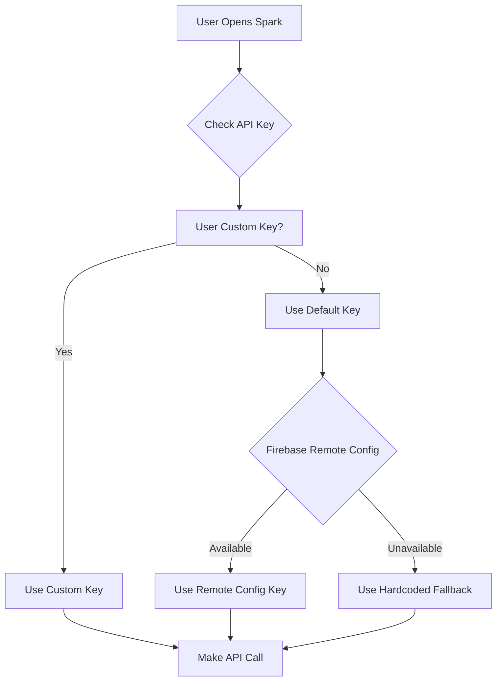

# Gemini API Key Management  

## Overview

This document outlines the plan to allow users to configure their own Gemini API key while maintaining a default fallback key that can be updated remotely via Firebase Remote Config. This enables sustainable scaling of AI features (currently used by RecAIpe and Minute Minder) without hitting rate limits on a single key.

## Current State

### Gemini Integration

Currently, Gemini is integrated in the following components:

1. **[GeminiService.ts](file:///Users/mattdyor/SparksApp/src/services/GeminiService.ts)** - Central service for Gemini API calls
   - Uses `process.env.EXPO_PUBLIC_GEMINI_API_KEY`
   - Provides `generateContent()` and `generateJSON<T>()` methods
   - Uses `gemini-2.5-flash` model

2. **[RecAIpeSpark.tsx](file:///Users/mattdyor/SparksApp/src/sparks/RecAIpeSpark.tsx)** - Recipe generation
   - Direct API call (not using GeminiService)
   - Hardcoded API key from env: `const GEMINI_API_KEY = process.env.EXPO_PUBLIC_GEMINI_API_KEY || '';`
   - Shows API key status in settings

3. **[MinuteMinderSpark.tsx](file:///Users/mattdyor/SparksApp/src/sparks/MinuteMinderSpark.tsx)** - Schedule scanning
   - Uses `GeminiService.generateJSON()` for image-to-schedule conversion
   - Delegates API key management to GeminiService

4. **[SpeakSpark.tsx](file:///Users/mattdyor/SparksApp/src/sparks/SpeakSpark.tsx)** - Voice command parsing (via GeminiCommandParser)
   - Uses `GeminiService.generateJSON()` via `GeminiCommandParser`
   - Shows API key status in UI

### Settings Structure

- **[appStore.ts](file:///Users/mattdyor/SparksApp/src/store/appStore.ts)** - Zustand store with AsyncStorage persistence
  - Current preferences: `theme`, `soundEnabled`, `hapticsEnabled`, `dailyNotificationsEnabled`
  - Persisted to `AsyncStorage` under key `sparks-app-storage`

- **[SettingsScreen.tsx](file:///Users/mattdyor/SparksApp/src/screens/SettingsScreen.tsx)** - Main settings UI
  - Organized into sections: Experience, My Sparks, Danger Zone, etc.
  - Uses `Switch` components for toggles

## Proposed Solution

### Architecture



### Key Components

#### 1. Enhanced App Store (`appStore.ts`)

Add Gemini API key to user preferences:

```typescript
interface UserPreferences {
  theme: 'light' | 'dark' | 'system';
  soundEnabled: boolean;
  hapticsEnabled: boolean;
  dailyNotificationsEnabled: boolean;
  customGeminiApiKey?: string; // NEW
}
```

#### 2. Remote Config Service (`RemoteConfigService.ts`)

Create a new service to manage Firebase Remote Config:

```typescript
interface RemoteConfigValues {
  default_gemini_api_key: string;
}

class RemoteConfigService {
  async initialize(): Promise<void>;
  async fetchAndActivate(): Promise<void>;
  getValue(key: keyof RemoteConfigValues): string;
  getDefaultGeminiApiKey(): string;
}
```

**Benefits:**
- Allows updating the default API key remotely without app updates
- Can switch keys if one runs out of quota
- Can distribute load across multiple keys based on user segments

#### 3. Enhanced Gemini Service (`GeminiService.ts`)

Update to use the key resolution hierarchy:

```typescript
export const GeminiService = {
  async getApiKey(): Promise<string> {
    // 1. Check for user's custom key
    const customKey = useAppStore.getState().preferences.customGeminiApiKey;
    if (customKey && customKey.trim()) {
      return customKey;
    }
    
    // 2. Check Firebase Remote Config
    try {
      const remoteKey = RemoteConfigService.getDefaultGeminiApiKey();
      if (remoteKey && remoteKey.trim()) {
        return remoteKey;
      }
    } catch (error) {
      console.warn('Failed to fetch remote config key:', error);
    }
    
    // 3. Fallback to env variable
    const envKey = process.env.EXPO_PUBLIC_GEMINI_API_KEY;
    if (!envKey) {
      throw new Error('No Gemini API key available');
    }
    return envKey;
  },

  generateContent: async (prompt: string, images: string[] = []): Promise<string> => {
    const apiKey = await this.getApiKey();
    // ... rest of implementation
  }
}
```

#### 4. Settings UI Enhancement

Add a new section in `SettingsScreen.tsx`:

```typescript
<View style={styles.section}>
  <Text style={styles.sectionTitle}>🤖 AI Configuration</Text>
  
  <View style={styles.settingItem}>
    <View style={styles.settingInfo}>
      <Text style={styles.settingLabel}>Gemini API Key</Text>
      <Text style={styles.settingDescription}>
        {customKey ? 'Using custom key' : 'Using default Sparks key'}
      </Text>
    </View>
    <TouchableOpacity onPress={handleOpenApiKeyModal}>
      <Text style={styles.linkText}>Configure</Text>
    </TouchableOpacity>
  </View>
  
  <Text style={styles.helpText}>
    Sparks uses Google's Gemini AI for features like RecAIpe and Minute Minder.
    By default, we provide a shared API key. You can add your own key to avoid
    rate limits.
  </Text>
</View>
```

#### 5. API Key Configuration Modal

Create a new modal component `GeminiApiKeyModal.tsx`:

Features:
- Text input for custom API key
- "Get Your Own Key" button linking to Google AI Studio
- "Test Key" button to validate the key
- "Clear Custom Key" to revert to default
- Masked display with "Show/Hide" toggle
- Visual indicator of which key source is active

## Implementation Plan

### Phase 1: Core Infrastructure

1. **Create Remote Config Service**
   - [ ] Create `src/services/RemoteConfigService.ts`
   - [ ] Initialize Firebase Remote Config in ServiceFactory
   - [ ] Add default parameter: `default_gemini_api_key`
   - [ ] Implement fetch and activation logic with caching
   - [ ] Add error handling and fallbacks

2. **Update App Store**
   - [ ] Add `customGeminiApiKey` to `UserPreferences` interface
   - [ ] Ensure persistence in AsyncStorage
   - [ ] Add getter/setter methods if needed

3. **Enhance Gemini Service**
   - [ ] Add `getApiKey()` method with hierarchy logic
   - [ ] Update `generateContent()` to use `getApiKey()`
   - [ ] Update `generateJSON()` to use `getApiKey()`
   - [ ] Add error handling for missing keys

### Phase 2: Settings UI

4. **Create API Key Modal**
   - [ ] Create `src/components/GeminiApiKeyModal.tsx`
   - [ ] Implement text input with masked display
   - [ ] Add "Get Your Own Key" link to https://makersuite.google.com/app/apikey
   - [ ] Add "Test Key" functionality (make a simple API call)
   - [ ] Add "Clear Custom Key" button
   - [ ] Show current key source indicator

5. **Update Settings Screen**
   - [ ] Add "AI Configuration" section
   - [ ] Add button to open API key modal
   - [ ] Show current key status (custom vs default)
   - [ ] Add helpful explanation text

### Phase 3: RecAIpe Migration

6. **Refactor RecAIpe to use GeminiService**
   - [ ] Remove direct API call in `RecAIpeSpark.tsx`
   - [ ] Use `GeminiService.generateJSON()` instead
   - [ ] Remove hardcoded `GEMINI_API_KEY` constant
   - [ ] Update settings display to show dynamic status

### Phase 4: Firebase Remote Config Setup

7. **Configure Firebase Console**
   - [ ] Add `default_gemini_api_key` parameter in Firebase Console
   - [ ] Set default value to current `EXPO_PUBLIC_GEMINI_API_KEY`
   - [ ] Configure appropriate fetch intervals (e.g., 12 hours)
   - [ ] Test remote updates

### Phase 5: Testing & Documentation

8. **Testing**
   - [ ] Test with no custom key (should use default)
   - [ ] Test with custom key (should use custom)
   - [ ] Test with invalid custom key (should show error)
   - [ ] Test remote config updates
   - [ ] Test offline behavior (should use cached remote config)
   - [ ] Test all Gemini features: RecAIpe, Minute Minder, Speak Spark

9. **Documentation**
   - [ ] Update user-facing help text
   - [ ] Document for future developers
   - [ ] Update SUMMARY.md

## Firebase Remote Config Setup

### Configuration in Firebase Console

1. Navigate to **Remote Config** in Firebase Console
2. Add parameter:
   - **Key**: `default_gemini_api_key`
   - **Data type**: String
   - **Default value**: `<current-api-key>`
   - **Description**: "Default Gemini API key used when user hasn't configured their own"

3. Set fetch interval:
   - Minimum fetch interval: 12 hours (prevents excessive fetching)
   - Cache expiration: 24 hours

### Default Values

In `RemoteConfigService.ts`, set defaults as fallback:

```typescript
const DEFAULT_VALUES = {
  default_gemini_api_key: process.env.EXPO_PUBLIC_GEMINI_API_KEY || '',
};
```

## User Flow

### First Time User
1. User opens RecAIpe or Minute Minder
2. App uses default Sparks API key (from Remote Config or env)
3. Feature works immediately, no configuration needed

### Power User (Hitting Rate Limits)
1. User sees rate limit error
2. User goes to Settings > AI Configuration
3. User taps "Configure" next to Gemini API Key
4. Modal opens with:
   - Current status: "Using default Sparks key"
   - "Get Your Own Key" button (opens Google AI Studio)
   - Text input for custom key
5. User gets key from Google AI Studio
6. User pastes key and taps "Test Key"
7. System validates key with a test API call
8. On success, key is saved to preferences
9. User sees updated status: "Using custom key"
10. All Gemini features now use the custom key

### Admin (You) - Updating Default Key
1. Current default key runs out of quota
2. You create new key in Google Cloud Console
3. You update `default_gemini_api_key` in Firebase Remote Config
4. All users without custom keys automatically get the new key within 12 hours
5. No app update required

## Security Considerations

> [!WARNING]
> **API Key Storage**
> User custom keys are stored in AsyncStorage, which is not encrypted on iOS/Android by default. This is acceptable for API keys as they're meant to be user-specific and low-risk (users can regenerate them). However, we should:

- **Don't** log API keys in console
- **Don't** send keys to analytics
- **Do** provide clear warnings about key security
- **Do** allow users to easily regenerate/replace keys

> [!IMPORTANT]
> **Rate Limiting**
> Even with custom keys, we should implement client-side rate limiting to prevent abuse and provide better error messages to users.

## Benefits

1. **Scalability**: Distribute load across user-provided keys
2. **Reliability**: Remote updates allow quick key rotation without app updates
3. **User Control**: Power users can use their own quota
4. **Graceful Degradation**: Multiple fallback levels ensure features keep working
5. **Cost Management**: Users who use features heavily can pay for their own API access

## Future Enhancements

- **Usage Analytics**: Track API usage per key source (anonymized)
- **Multiple Providers**: Support for other AI providers (OpenAI, Anthropic, etc.)
- **Key Rotation**: Automatic rotation between multiple Sparks keys based on quota
- **Usage Warnings**: Notify users when approaching quota limits
- **Shared Keys**: Allow users to share keys within organizations/families

## Technical Notes

### Firebase Remote Config Integration

Firebase Remote Config is already available in the project through `@react-native-firebase/app` and `@react-native-firebase/firestore`. We'll need to add:

```bash
npm install @react-native-firebase/remote-config
```

### Error Handling

API key resolution should handle:
- Invalid custom keys (test before saving)
- Network failures when fetching remote config
- Quota exceeded errors (suggest custom key)
- Malformed keys (validation)

### Migration Strategy

Since this is a new feature:
- No data migration needed
- All existing users continue with default key
- New preference field is optional (`customGeminiApiKey?`)
- Backward compatible

## Open Questions

1. Should we validate custom keys before saving? (Yes - add "Test Key" button)
2. Should we show usage statistics to users? (Future enhancement)
3. Should we cache the remote config key locally? (Yes - Firebase SDK does this automatically)
4. Should we support multiple API keys per user? (No - keep it simple)
5. Should we add a "Use Sparks Key" quick toggle? (Yes - "Clear Custom Key" button)

---

**Status**: Draft  
**Created**: 2025-12-12  
**Last Updated**: 2025-12-12  
**Owner**: Matt Dyor
