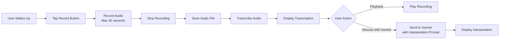

# Dream Catcher Spark Implementation Plan

A morning dream journal that records audio of dream recollections, transcribes them, and provides AI-powered dream interpretation using Gemini.

## User Review Required

> [!IMPORTANT]
> **Audio Recording**: Uses `expo-av` Audio.Recording (already in dependencies)
> 
> **Audio Transcription**: Requires audio transcription service - options:
> 1. Google Cloud Speech-to-Text API (recommended for accuracy)
> 2. Gemini API with audio input (if supported)
> 3. AssemblyAI or similar service
> 
> **Gemini API Usage**: Each dream interpretation will make a Gemini API call

## Architecture

### Core Flow


### Components

#### 1. DreamCatcherSpark.tsx (Main UI)
- Large record button (morning-friendly design)
- Recording state with timer (0-30 seconds)
- Playback controls for recorded audio
- Transcription display area
- "Discuss with Gemini" button
- Dream history list
- Settings for transcription service configuration

#### 2. DreamRecordingService.ts (New Service)
- Audio recording management using `expo-av`
- Recording duration limit (30 seconds)
- Audio file storage (local filesystem)
- Playback functionality
- Cleanup of old recordings

#### 3. AudioTranscriptionService.ts (New Service)
- Audio transcription using chosen service
- Support for multiple transcription providers
- Error handling and retry logic
- Format conversion (audio file → transcription text)

#### 4. DreamStorageService.ts (New Service)
- Store dream entries with:
  - Audio file URI
  - Transcription text
  - Timestamp
  - Gemini interpretation (optional)
- AsyncStorage backed
- Query by date range

#### 5. GeminiService Integration
- Extend existing GeminiService for dream interpretation
- Custom prompt for dream analysis
- Return formatted interpretation

---

## Proposed Changes

### [NEW] Audio Recording Service

#### [NEW] [DreamRecordingService.ts](file:///Users/mattdyor/SparksApp/src/services/DreamRecordingService.ts)
Audio recording service using expo-av:
- `startRecording(maxDuration: number)`: Begin recording with duration limit
- `stopRecording()`: End recording and return audio URI
- `playRecording(uri: string)`: Play back recorded audio
- `deleteRecording(uri: string)`: Clean up audio file
- Error handling for permissions and recording failures

**Recording Configuration**:
```typescript
const recordingOptions = {
  ...Audio.RecordingOptionsPresets.HIGH_QUALITY,
  android: {
    ...Audio.RecordingOptionsPresets.HIGH_QUALITY.android,
    numberOfChannels: 1,
    bitRate: 128000,
  },
  ios: {
    ...Audio.RecordingOptionsPresets.HIGH_QUALITY.ios,
    numberOfChannels: 1,
    bitRate: 128000,
  },
  web: {
    mimeType: 'audio/webm',
    bitsPerSecond: 128000,
  },
};
```

---

### [NEW] Audio Transcription Service

#### [NEW] [AudioTranscriptionService.ts](file:///Users/mattdyor/SparksApp/src/services/AudioTranscriptionService.ts)
Audio transcription service with provider abstraction:

**Interface**:
```typescript
interface TranscriptionProvider {
  transcribe(audioUri: string): Promise<string>;
  isAvailable(): boolean;
}
```

**Implementation Options**:

1. **Google Cloud Speech-to-Text** (Recommended)
   - High accuracy
   - Requires Google Cloud account and API key
   - Best for production use
   - Implementation:
     ```typescript
     async transcribe(audioUri: string): Promise<string> {
       // Convert audio file to base64
       // Call Google Cloud Speech-to-Text API
       // Return transcription
     }
     ```

2. **Gemini Audio API** (If available)
   - Uses existing Gemini API key
   - Simpler setup
   - May have limitations
   - Implementation:
     ```typescript
     async transcribe(audioUri: string): Promise<string> {
       // Convert audio to base64
       // Call Gemini API with audio input
       // Return transcription
     }
     ```

3. **AssemblyAI** (Alternative)
   - Good accuracy
   - Requires API key
   - Easy integration
   - Implementation:
     ```typescript
     async transcribe(audioUri: string): Promise<string> {
       // Upload audio to AssemblyAI
       // Poll for transcription result
       // Return transcription
     }
     ```

**Service Methods**:
- `transcribe(audioUri: string)`: Transcribe audio file to text
- `setProvider(provider: TranscriptionProvider)`: Switch transcription provider
- `getAvailableProviders()`: List available providers
- Error handling with user-friendly messages

---

### [NEW] Dream Storage Service

#### [NEW] [DreamStorageService.ts](file:///Users/mattdyor/SparksApp/src/services/DreamStorageService.ts)
Dream entry storage and retrieval:

**Storage Schema**:
```typescript
interface DreamEntry {
  id: string;
  timestamp: number;
  date: string; // YYYY-MM-DD format
  audioUri: string;
  transcription: string;
  geminiInterpretation?: string;
  tags?: string[];
}
```

**Methods**:
- `saveDream(entry: Omit<DreamEntry, 'id'>)`: Save new dream entry
- `getDreamsByDateRange(startDate: string, endDate: string)`: Get dreams in date range
- `getDreamById(id: string)`: Get specific dream
- `deleteDream(id: string)`: Delete dream and associated audio file
- `updateDream(id: string, updates: Partial<DreamEntry>)`: Update dream entry

**Storage Key**: `@dream-catcher/dreams`

---

### Main Spark Component

#### [NEW] [DreamCatcherSpark.tsx](file:///Users/mattdyor/SparksApp/src/sparks/DreamCatcherSpark.tsx)

**UI States**:
1. **Idle**: Large record button with dream icon, "Record Your Dream" text
2. **Recording**: 
   - Animated pulsing record button
   - Timer display (0:00 - 0:30)
   - "Recording..." text
   - Stop button
3. **Recorded**:
   - Playback button
   - Transcription area (editable)
   - "Discuss with Gemini" button
   - Save/Discard options
4. **Transcribing**:
   - Loading spinner
   - "Transcribing your dream..." text
5. **Transcribed**:
   - Display transcription
   - Edit transcription option
   - "Discuss with Gemini" button
6. **Interpreting**:
   - Loading spinner
   - "Analyzing your dream..." text
7. **Interpreted**:
   - Display Gemini interpretation
   - Save to history

**History Section**:
- ScrollView of past dreams
- Each entry shows:
  - Date and time
  - Transcription preview (first 100 chars)
  - Playback button
  - "View Interpretation" button (if available)
  - Delete button

**Permissions**:
- Request microphone permission on mount
- Helpful message if denied
- Guide user to settings if needed

---

### Gemini Integration

#### [MODIFY] [GeminiService.ts](file:///Users/mattdyor/SparksApp/src/services/GeminiService.ts)
Add dream interpretation method:

```typescript
interpretDream: async (dreamText: string): Promise<string> => {
  const prompt = `You are a dream interpretation expert. Analyze this dream and provide a thoughtful interpretation.

Dream: "${dreamText}"

Please provide:
1. A brief summary of the dream's themes
2. Possible symbolic meanings
3. Potential psychological insights
4. Any patterns or recurring themes

Keep the interpretation thoughtful but accessible, and avoid overly clinical language.`;

  return await GeminiService.generateContent(prompt);
}
```

**Alternative**: If using Gemini for transcription, add audio input support:
```typescript
transcribeAudio: async (audioBase64: string, mimeType: string): Promise<string> => {
  // Use Gemini's audio input capability
  // This depends on Gemini API support for audio
}
```

---

## Storage Schema

### Dream Entry Type
```typescript
interface DreamEntry {
  id: string; // UUID
  timestamp: number; // Unix timestamp
  date: string; // YYYY-MM-DD format for easy querying
  audioUri: string; // Local file URI
  transcription: string; // Transcribed text
  geminiInterpretation?: string; // Optional AI interpretation
  tags?: string[]; // User-defined tags
  createdAt: number; // When entry was created
  updatedAt: number; // Last update timestamp
}
```

**Storage Structure**:
```typescript
{
  '@dream-catcher/dreams': DreamEntry[],
  '@dream-catcher/settings': {
    transcriptionProvider: 'google-cloud' | 'gemini' | 'assemblyai',
    autoTranscribe: boolean,
    autoInterpret: boolean,
  }
}
```

---

## Gemini Prompt Design

### Dream Interpretation Prompt
```
You are a dream interpretation expert with knowledge of psychology, symbolism, and dream analysis. 

Analyze this dream recollection and provide a thoughtful, accessible interpretation:

"{dreamText}"

Please structure your response as follows:

**Dream Summary**
[Brief 2-3 sentence summary of the main themes]

**Symbolic Meanings**
[Identify key symbols and their potential meanings]

**Psychological Insights**
[What might this dream reveal about the dreamer's thoughts, feelings, or experiences?]

**Reflection Questions**
[2-3 questions to help the dreamer reflect on their dream]

Keep the tone warm, insightful, and encouraging. Avoid overly clinical or diagnostic language. Focus on helping the dreamer understand and reflect on their dream experience.
```

### Example Response
```
**Dream Summary**
This dream appears to center around themes of transformation and navigating unfamiliar territory. The presence of water and bridges suggests you may be processing a transition or decision in your waking life.

**Symbolic Meanings**
- Water often represents emotions or the unconscious mind
- Bridges symbolize transitions, connections, or decisions
- The feeling of being lost may reflect uncertainty about a current situation

**Psychological Insights**
This dream might be reflecting your feelings about a significant change or decision you're facing. The mix of uncertainty and movement suggests you're processing this transition, even if you're not fully aware of it consciously.

**Reflection Questions**
- What transitions or changes are you currently experiencing in your life?
- How do you feel about navigating new situations or making decisions?
- What connections or bridges are you trying to build in your relationships or career?
```

---

## Audio Transcription Implementation

### Option 1: Google Cloud Speech-to-Text (Recommended)

**Setup**:
1. Create Google Cloud project
2. Enable Speech-to-Text API
3. Create service account and download JSON key
4. Store API key securely (environment variable or secure storage)

**Implementation**:
```typescript
import { SpeechClient } from '@google-cloud/speech';

class GoogleCloudTranscriptionProvider implements TranscriptionProvider {
  private client: SpeechClient;

  constructor() {
    const apiKey = process.env.EXPO_PUBLIC_GOOGLE_CLOUD_SPEECH_API_KEY;
    this.client = new SpeechClient({ keyFilename: apiKey });
  }

  async transcribe(audioUri: string): Promise<string> {
    // Read audio file
    const audioBytes = await FileSystem.readAsStringAsync(audioUri, {
      encoding: FileSystem.EncodingType.Base64,
    });

    const request = {
      audio: { content: audioBytes },
      config: {
        encoding: 'LINEAR16',
        sampleRateHertz: 44100,
        languageCode: 'en-US',
        enableAutomaticPunctuation: true,
      },
    };

    const [response] = await this.client.recognize(request);
    const transcription = response.results
      .map(result => result.alternatives[0].transcript)
      .join('\n');

    return transcription;
  }
}
```

### Option 2: Gemini Audio API (If Available)

**Implementation**:
```typescript
class GeminiTranscriptionProvider implements TranscriptionProvider {
  async transcribe(audioUri: string): Promise<string> {
    const apiKey = process.env.EXPO_PUBLIC_GEMINI_API_KEY;
    
    // Convert audio to base64
    const audioBase64 = await FileSystem.readAsStringAsync(audioUri, {
      encoding: FileSystem.EncodingType.Base64,
    });

    const response = await fetch(
      `https://generativelanguage.googleapis.com/v1/models/gemini-2.0-flash-exp:generateContent?key=${apiKey}`,
      {
        method: 'POST',
        headers: { 'Content-Type': 'application/json' },
        body: JSON.stringify({
          contents: [{
            parts: [{
              inline_data: {
                mime_type: 'audio/mpeg',
                data: audioBase64
              }
            }, {
              text: 'Transcribe this audio recording of a dream.'
            }]
          }]
        })
      }
    );

    const data = await response.json();
    return data.candidates[0].content.parts[0].text;
  }
}
```

### Option 3: AssemblyAI

**Implementation**:
```typescript
class AssemblyAITranscriptionProvider implements TranscriptionProvider {
  async transcribe(audioUri: string): Promise<string> {
    const apiKey = process.env.EXPO_PUBLIC_ASSEMBLYAI_API_KEY;
    
    // Upload audio
    const uploadResponse = await fetch('https://api.assemblyai.com/v2/upload', {
      method: 'POST',
      headers: { authorization: apiKey },
      body: await FileSystem.readAsStringAsync(audioUri, { encoding: FileSystem.EncodingType.Base64 }),
    });
    
    const { upload_url } = await uploadResponse.json();
    
    // Start transcription
    const transcriptResponse = await fetch('https://api.assemblyai.com/v2/transcript', {
      method: 'POST',
      headers: { authorization: apiKey, 'content-type': 'application/json' },
      body: JSON.stringify({ audio_url: upload_url }),
    });
    
    const { id } = await transcriptResponse.json();
    
    // Poll for result
    let transcript;
    while (true) {
      const resultResponse = await fetch(`https://api.assemblyai.com/v2/transcript/${id}`, {
        headers: { authorization: apiKey },
      });
      transcript = await resultResponse.json();
      if (transcript.status === 'completed') break;
      if (transcript.status === 'error') throw new Error('Transcription failed');
      await new Promise(resolve => setTimeout(resolve, 1000));
    }
    
    return transcript.text;
  }
}
```

---

## Spark Registry Updates

#### [MODIFY] [SparkRegistry.tsx](file:///Users/mattdyor/SparksApp/src/components/SparkRegistry.tsx)
Add DreamCatcherSpark entry:
```typescript
{
  id: 'dream-catcher',
  name: 'Dream Catcher',
  emoji: '🌙',
  description: 'Record and interpret your dreams',
  color: '#6B46C1',
  component: DreamCatcherSpark,
  category: 'wellness',
  isAvailable: true,
}
```

---

## UI/UX Design Considerations

### Morning-Friendly Design
- Large, easy-to-tap record button
- Minimal cognitive load (user just woke up)
- Clear visual feedback during recording
- Simple, calming color scheme

### Recording Flow
1. **Wake up** → Open app → Tap Dream Catcher
2. **Record** → Large button, clear timer, easy stop
3. **Review** → Playback, see transcription, edit if needed
4. **Interpret** → Optional Gemini analysis
5. **Save** → Automatically saved to history

### Error Handling
- Microphone permission denied → Clear instructions
- Recording failed → Retry option
- Transcription failed → Manual entry option
- Network error → Offline mode, queue for later

---

## Verification Plan

### Automated Tests
- Audio recording start/stop
- Duration limit enforcement (30 seconds)
- Storage save/retrieve
- Transcription service integration (mock)

### Manual Verification

1. **Basic Recording Flow**:
   - Tap record button
   - Speak for 10 seconds
   - Stop recording
   - Verify audio playback works
   - Verify transcription appears

2. **Transcription**:
   - Record clear speech
   - Verify accurate transcription
   - Test with background noise
   - Test with mumbled speech

3. **Gemini Interpretation**:
   - Record a dream
   - Transcribe
   - Tap "Discuss with Gemini"
   - Verify interpretation appears
   - Verify interpretation is thoughtful and relevant

4. **History**:
   - Record 3-4 dreams
   - Verify all appear in history
   - Test playback from history
   - Test viewing interpretations from history
   - Test deletion

5. **Edge Cases**:
   - Record for exactly 30 seconds (auto-stop)
   - Record very short dream (< 5 seconds)
   - Record with background noise
   - Transcription fails → Manual entry option
   - Network offline → Queue interpretation for later
   - Microphone permission denied → Clear error message

6. **Storage**:
   - Record dream
   - Close app
   - Reopen app
   - Verify dream persists
   - Verify audio file still plays

---

## Future Enhancements

1. **Dream Patterns**:
   - Analyze recurring themes across dreams
   - Visualize dream frequency
   - Tag system for categorization

2. **Voice Wake-Up**:
   - Integration with morning alarm
   - Auto-open Dream Catcher when alarm goes off

3. **Dream Sharing**:
   - Share dreams with friends
   - Compare interpretations

4. **Advanced AI Features**:
   - Dream journaling prompts
   - Sleep quality correlation
   - Lucid dreaming tips

5. **Offline Support**:
   - Queue transcriptions when offline
   - Sync when online

---

## Dependencies

### Existing (Already Installed)
- `expo-av` - Audio recording and playback
- `expo-file-system` - File storage
- `@react-native-async-storage/async-storage` - Data persistence

### New (May Need)
- `@google-cloud/speech` - If using Google Cloud Speech-to-Text
- Or API keys for chosen transcription service

---

## Implementation Phases

### Phase 1: Core Recording (MVP)
- [ ] DreamRecordingService implementation
- [ ] Basic UI with record/playback
- [ ] Local storage of audio files
- [ ] Dream history display

### Phase 2: Transcription
- [ ] AudioTranscriptionService implementation
- [ ] Integration with chosen provider
- [ ] Transcription display and editing
- [ ] Error handling

### Phase 3: Gemini Integration
- [ ] Dream interpretation prompt
- [ ] "Discuss with Gemini" functionality
- [ ] Interpretation display
- [ ] Save interpretations

### Phase 4: Polish
- [ ] Settings for transcription provider
- [ ] Improved error messages
- [ ] History filtering/search
- [ ] UI refinements

---

## Notes

- **Transcription Accuracy**: Real-time speech-to-text (like Speak Spark) can be inaccurate. Recording first, then transcribing, should improve accuracy significantly.

- **Audio Quality**: Using HIGH_QUALITY preset should provide good transcription results.

- **Privacy**: Dreams are personal. Ensure clear privacy policy and secure storage.

- **Morning UX**: Design for groggy morning users - large buttons, clear feedback, minimal steps.

